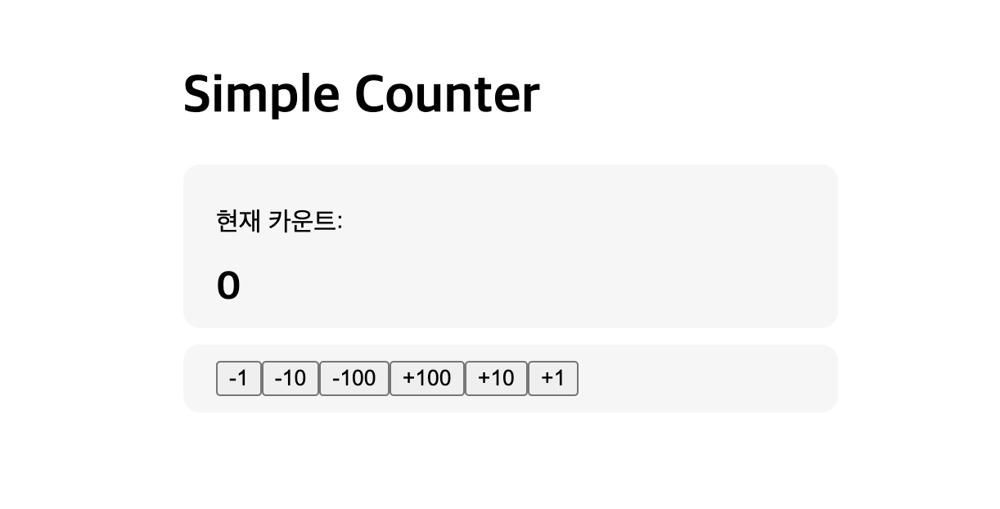

# Project01 - Simple Counter

1. 여러 개의 컴포넌트들이 서로 부모와 자식 관계를 이루며 계층 구조를 형성한다.
2. 특정 컴포넌트가 다른 컴포넌트에게 데이터를 전달하려면 반드시 서로 부모 자식 관계를 가지고 있어야 한다.
3. 그래서 하나의 state를 여러 컴포넌트에서 관리하게 될 경우 공통 부모가 되는 곳에 만들어야 한다. = State Lifting(state 끌어올리기)
4. 즉, 리액트에서는 props라는 기능을 이용해서 부모에서 자식 방향으로만 데이터를 전달 할 수 있다. = 단반향 데이터 흐름

=> 데이터의 원천인 state를 어떤 컴포넌트에 위치시킬 것인지 항상 잘 고민하고 고려해서 결정해야 한다!
