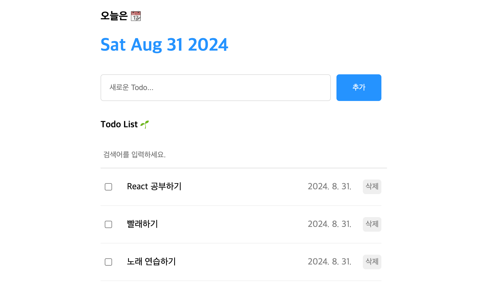

# Project02 - To Do List

1. 상태 끌어올리기 사용
2. Create - input에 value값 있을 때, 추가 버튼 및 엔터 사용 시 투두리스트에 추가
3. Read - 검색어를 입력하면 입력한 값이 include된 리스트 표시
4. Update - targetId와 리스트의 id가 같을 때만 체크되고 나머지는 그대로 렌더링(map 메서드 사용)
5. Delete - targetId와 리스트의 id가 같지 않은 리스트만 렌더링(filter 메서드 사용)

### useReducer

> 컴포넌트 내부에 새로운 State를 생성하는 React Hook
> 모든 useState는 useReducer로 대체 가능
> 상태 관리 코드를 컴포넌트 외부로 분리할 수 있음
